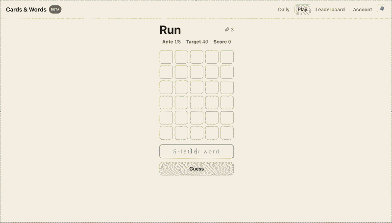
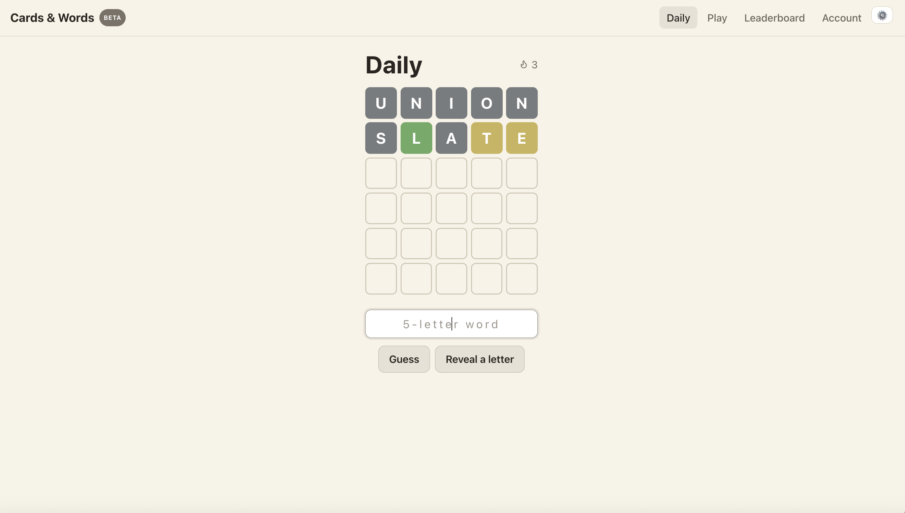
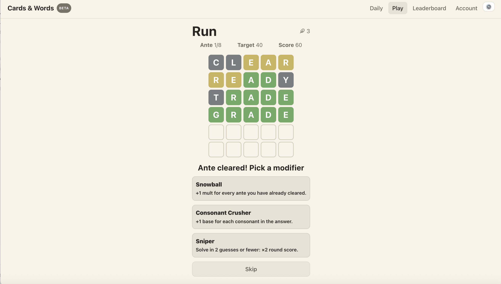
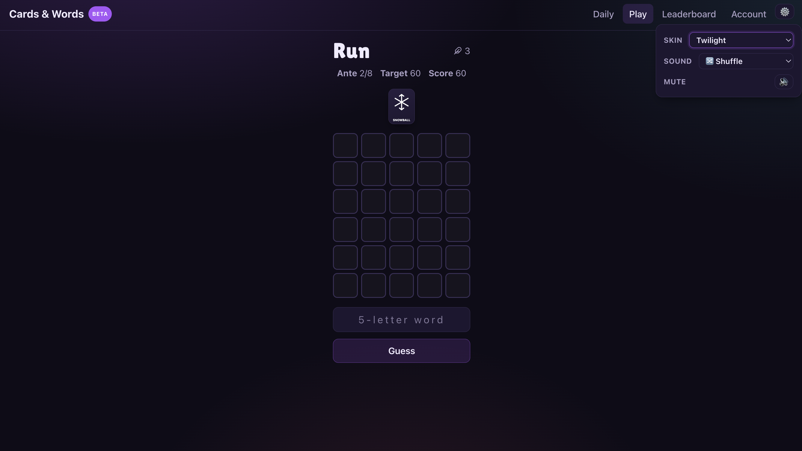

# Cards & Words 🎴

A web word game that mixes the simplicity of **Wordle** with the roguelike runs, stacking
modifiers and escalating tension of **Balatro** — wrapped in a small but real
ship-it-and-operate-it stack.

More than the game, the point is to demonstrate the infrastructure and operations side of
shipping a real product — Docker, CI/CD, a VPS behind Nginx, secrets, health checks and
monitoring.

**Live demo:** [birkelandboss.no](https://birkelandboss.no)
**Status:** Early access / beta. Playable end to end; gameplay balance, art and audio are
still being polished.

<p align="center">
  
</p>

---

## Why we built this

The subjects I enjoyed most during my bachelor in **Digital Infrastructure and Cybersecurity
at NTNU** were the ones about _making something_ — development — and everything around the
code: Linux, virtualization, cloud, monitoring, infrastructure as code, wrangling servers. I
wanted to practise all of that on something real and live, not a tutorial.

The spark was small: during our bachelor thesis we played Wordle every day, and a fellow
student of mine, Jørgen, pitched the idea — _what if Wordle had Balatro-style roguelike runs?_
So we built the beta version: a simple, fun game as the vehicle, with real engineering behind
it — Docker, CI/CD, a VPS behind Nginx, secrets, a health endpoint and monitoring.

<p align="center">
  
  <br><em>The daily puzzle — same word for everyone, with a streak.</em>
</p>

## Engineering highlights

The game itself is intentionally simple. The interesting part is everything behind it:

- **Two games, one app.** A daily Wordle and a Balatro-style roguelike run share one auth, one
  database, one deployment and one **word engine** (`lib/words`) — only the gameplay differs.
  Game logic is pure TypeScript, kept separate from React, and unit-tested.
- **Supabase + row-level security (RLS)** — access is enforced in the database, not the
  frontend, so the public key is safe to ship; one flexible `runs` table powers both
  leaderboards and sharing.
- **Multi-stage Docker, served by Nginx:** Node builds the app, Nginx serves the static output,
  with an **SPA fallback** so deep links don't 404 and a **`/health`** endpoint for monitoring.
- **CI/CD:** GitHub Actions runs lint + tests + build on every push, then SSH-deploys to the
  VPS on merge to `main`. Secrets live in GitHub Secrets, never in the repo.
- **Monitoring with a bit of nuance:** an external **UptimeRobot** check hits `/health` from
  off-box (a monitor on the same server dies _with_ the server), while a self-hosted **Uptime
  Kuma** gives a dashboard.
- **Real-world resilience.** Shipping for real means hitting real problems: after switching the
  container from the dev server to a proper static Nginx build, production went blank — Vite
  inlines environment variables at _build_ time and the Docker build had none. Diagnosing and
  fixing that (passing the values as build args) was exactly the kind of build-time-vs-runtime
  lesson I wanted from this project.

## The game

- **Daily** — a date-seeded Wordle: everyone gets the same word, with a streak and a shareable
  result.
- **Roguelike** — a run of word rounds with rising target scores, three lives, and stacking
  **modifiers** you pick between antes (vowel bonuses, fast-solve multipliers, comebacks…).
  Clear the final ante to win; miss a target too often and the run ends.

<p align="center">
  
  <br><em>A roguelike run — stacking modifier cards above the board.</em>
</p>
<p align="center">
  
  <br><em>…and you can swap skins on the fly — here's one of the dark ones (default is a clean "Classic").</em>
</p>

## Tech stack

React 19 + TypeScript (Vite) · Supabase (Postgres + row-level security) · Vitest · Docker +
docker-compose · GitHub Actions (CI/CD) · Hetzner VPS + Nginx · UptimeRobot + Uptime Kuma ·
deployed at [birkelandboss.no](https://birkelandboss.no).

## Run it locally

The games themselves run client-side, so you can play without any backend:

```bash
cd app
npm install
npm run dev      # http://localhost:5173
```

Auth, saving and leaderboards need a Supabase project — see
[`CONTRIBUTING.md`](CONTRIBUTING.md) for the full setup, Docker usage, and the database schema
(`infra/supabase/schema.sql`). Architecture and decisions live in
[`docs/architecture-and-decisions.md`](docs/architecture-and-decisions.md).

## License

MIT — see [`LICENSE`](LICENSE). Built by Tor Arne Birkeland and Jørgen Fenstad Kottum (GoshDaymStudios).

---

Made by two buddies who wanted an excuse to ship something real. Hope you enjoy a run or two —
and thanks for reading. 🎴
